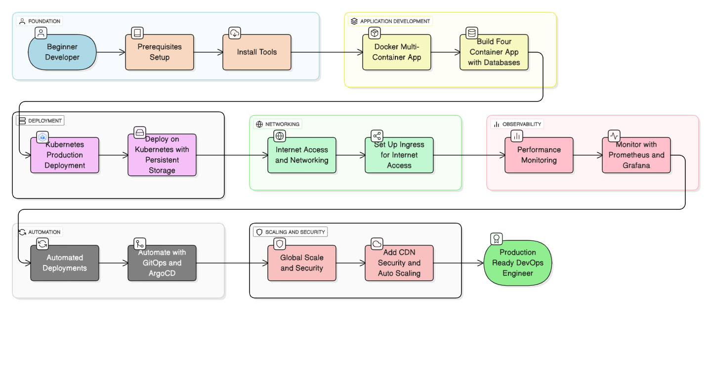
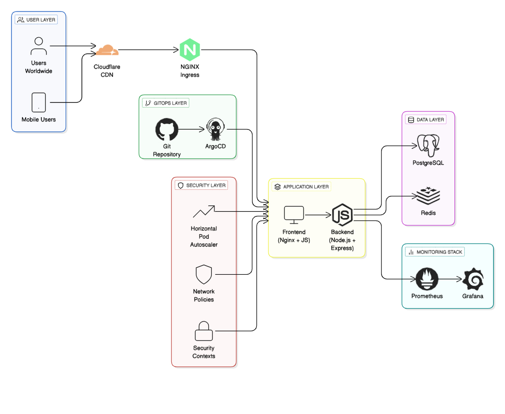
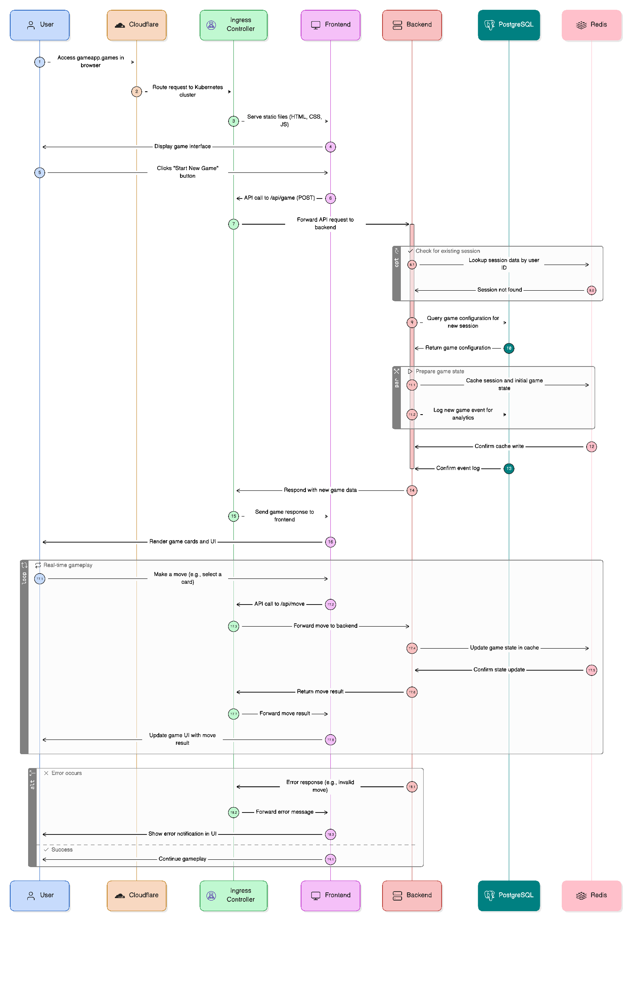

# 🎮 Kubernetes Tutorial: Build Production Apps from Scratch

*Learn DevOps by building a real application: Docker → Kubernetes → Monitoring → GitOps → Global Deployment. Perfect for career switchers and beginners.*

> This project is part of the **Zee DevOps Learning Path**  
> Start: Quick Wins → Core: Beginner-DevOps-Labs → Reference: Troubleshooting Toolkit → Portfolio: Weekend Projects → Cloud: Cloud-DevOps-Projects

[](https://kubernetes.io/)
[](https://docker.com/)
[](https://prometheus.io/)
[](https://argoproj.github.io/)

---

## 🎯 **What You'll Learn**

By completing this tutorial, you'll master:
- **Container orchestration** with Kubernetes (the same tech Netflix uses)
- **Production monitoring** with Prometheus and Grafana dashboards
- **Automated deployments** using GitOps principles
- **Global scaling** with CDN and load balancing
- **Real troubleshooting skills** that DevOps engineers use daily

**Career Impact**: These skills are in high demand. DevOps engineers with Kubernetes experience earn 20-30% more than those without it.

## 📈 **Learning Path Overview**



*Follow this step-by-step progression from beginner developer to production-ready DevOps engineer*

---

## 🌟 **Live Demo**


*Experience the Humor Memory Game: A DevOps Learning Adventure! - A web-based memory game featuring a 4x4 grid of cards, game statistics, and navigation tabs for Game, Leaderboard, My Stats, and About.*

---

## 🚀 **Quick Start Guide**

### **Option 1: Complete Learning Path (Recommended for Beginners)**
```bash
# 1. Install prerequisites
# Follow the guide: docs/01-prereqs.md

# 2. Follow step-by-step guides
# Start with: docs/01-prereqs.md
# Then follow: docs/02-compose.md → ... → docs/07-global.md
```

### **Option 2: Fast Deploy (For Experienced Users)**
```bash
# Deploy everything at once
git clone https://github.com/Osomudeya/DevOps-Home-Lab-2025.git
cd DevOps-Home-Lab-2025
make deploy-all

# Verify deployment
make verify
```

### **Option 3: Local Development Only**
```bash
# Quick local setup with Docker Compose
docker-compose up -d
curl http://localhost:3001/api/health
```

---

## 🎯 **What You'll Build**



*Complete production-grade infrastructure with monitoring, security, and global scaling*

### **🏗️ Production Application Stack**
- 🎮 **Humor Memory Game** - Interactive web application with leaderboards
- 🔄 **4 Microservices** - Frontend, Backend, PostgreSQL, Redis
- 🌐 **Global CDN** - Cloudflare edge caching and DDoS protection
- 📊 **Full Observability** - Metrics, logs, traces, and custom dashboards
- 🔒 **Enterprise Security** - Network policies, security contexts, auto-scaling

### **🛠️ Technology Stack**

| Layer | Technology | Purpose |
|-------|------------|---------|
| **Application** | Node.js + Express, Vanilla JS | Game logic and UI |
| **Database** | PostgreSQL 15, Redis 7 | Persistent data and caching |
| **Container** | Docker, Multi-stage builds | Application packaging |
| **Orchestration** | Kubernetes (k3d), NGINX Ingress | Container management |
| **Monitoring** | Prometheus, Grafana | Metrics and visualization |
| **GitOps** | ArgoCD, Git-based workflows | Automated deployments |
| **Security** | Network Policies, Security Contexts | Defense-in-depth |
| **Global Access** | Cloudflare CDN + Tunnels | Worldwide distribution |

---

## 📋 **Learning Milestones**

| Milestone | What You'll Learn | Time | Difficulty |
|-----------|-------------------|------|------------|
| **[0. Prerequisites](docs/01-prereqs.md)** | Development environment setup | 15-30 min | 🟢 Beginner |
| **[1. Docker Compose](docs/02-compose.md)** | Multi-container application | 30-45 min | 🟢 Beginner |
| **[2. Kubernetes Basics](docs/03-k8s-basics.md)** | Production app deployment | 45-60 min | 🟡 Intermediate |
| **[3. Production Ingress](docs/04-ingress.md)** | Internet access and networking | 30-45 min | 🟡 Intermediate |
| **[4. Observability](docs/05-observability.md)** | Performance monitoring | 60-90 min | 🟡 Intermediate |
| **[5. GitOps](docs/06-gitops.md)** | Automated deployments | 45-60 min | 🟠 Advanced |
| **[6. Global Production](docs/07-global.md)** | Global scale and security | 90-120 min | 🔴 Expert |

**📚 Total Learning Time**: 5-8 hours  
**🎯 Skill Level**: Beginner to Production-Ready DevOps Engineer

## 🔄 **How It Works**



*Real-time user interaction flow from browser to database with error handling*

---

## 🏆 **What Makes This Special**

### **✨ Beginner-Friendly Features**
- 📖 **Step-by-step guides** with copy-paste commands
- 🎯 **Clear learning objectives** for each milestone
- 🔧 **Comprehensive troubleshooting** with common issues and solutions
- 🎪 **Real application** - not just "hello world" demos
- 📝 **Interview preparation** guide with technical questions

### **🚀 Production-Grade Features**
- ⚡ **Zero-downtime deployments** with rolling updates
- 📈 **Horizontal auto-scaling** based on CPU/memory metrics
- 🔍 **Full observability stack** with custom dashboards and alerting
- 🔒 **Enterprise security** with network policies and security contexts
- 🌍 **Global CDN distribution** with edge caching
- 🔄 **GitOps automation** for reliable, auditable deployments

### **🎓 Skills You'll Master**
- **Container Orchestration**: Kubernetes deployment strategies
- **Infrastructure as Code**: Declarative configurations and GitOps
- **Monitoring & Observability**: Metrics, dashboards, alerting
- **Production Security**: Network policies, security contexts, secrets
- **CI/CD & Automation**: GitOps workflows and deployment pipelines
- **Global Scale**: CDN integration and performance optimization

---

## 📚 **Complete Documentation**

### **📖 Core Tutorials**
- **[🎯 Learning Path Overview](docs/00-overview.md)** - Complete tutorial roadmap
- **[⚙️ Development Environment Setup](docs/01-prereqs.md)** - Install all required tools
- **[🐳 Docker Multi-Container App](docs/02-compose.md)** - Build your first containerized app
- **[☸️ Kubernetes Production Deployment](docs/03-k8s-basics.md)** - Deploy apps on Kubernetes
- **[🌐 Internet Access & Networking](docs/04-ingress.md)** - Make your app accessible worldwide
- **[📊 Performance Monitoring](docs/05-observability.md)** - Track app health and performance
- **[🔄 Automated Deployments](docs/06-gitops.md)** - Deploy with GitOps automation
- **[🌍 Global Scale & Security](docs/07-global.md)** - Production hardening and CDN

### **🔧 Reference Materials**
- **[🚨 Troubleshooting](docs/08-troubleshooting.md)** - Common issues and solutions
- **[❓ FAQ](docs/09-faq.md)** - Frequently asked questions
- **[📖 Glossary](docs/10-glossary.md)** - Technical terms and definitions
- **[📝 Decision Notes](docs/11-decision-notes.md)** - Architecture decisions explained

### **🛠️ Advanced Guides**
- **[🔒 Security Contexts](docs/security-contexts-guide.md)** - Production security hardening
- **[📊 Custom Dashboards](docs/custom-dashboard-guide.md)** - Build monitoring dashboards
- **[🌐 Cloudflare Setup](docs/cloudflare-tunnel-setup-guide.md)** - Global CDN configuration
- **[🔍 Monitoring Troubleshooting](docs/monitoring-troubleshooting.md)** - Fix monitoring issues
- **[🔄 GitOps Deep Dive](docs/argocd-deep-dive.md)** - Advanced GitOps patterns
- **[🌍 Global Deployment](docs/global-deployment-troubleshooting.md)** - Production scaling issues

### **🎯 Career Development**
- **[🎤 Interview Prep Guide](interviewprep.md)** - Technical interview preparation
- **[📊 Architecture Overview](docs/00-overview.md#architecture-overview)** - Visual system documentation

### **📁 Project Files**
- **[🏠 Home Lab Guide](home-lab.md)** - Complete project overview
- **[📋 File Structure](FILE-STRUCTURE.md)** - Project organization guide
- **[🔒 Security Policy](SECURITY.md)** - Security guidelines and reporting
- **[⚙️ Makefile](Makefile)** - Automation commands and shortcuts

---

## ⚠️ **Important Setup Notes**

### **🔑 Domain Configuration**
> **CRITICAL**: This project uses `gameapp.games` as an example domain. For your own deployment:
> 1. **Get a domain** (free options available for learning)
> 2. Replace all instances of `gameapp.games` with your domain
> 3. Configure Cloudflare DNS for your domain
> 4. Update ingress configurations accordingly
> 
> **📝 See**: [Domain Replacement Guide](docs/domain-replacement-guide.md) | [Free Domain Setup](docs/07-global.md#step-3a-prerequisites---get-a-domain)

### **💻 System Requirements**
- **RAM**: 4GB+ available for Kubernetes cluster
- **Storage**: 10GB+ free disk space
- **OS**: macOS, Linux, or Windows with WSL2
- **Network**: Stable internet for image downloads

### **🛠️ Required Tools**
```bash
# Essential tools (install via prerequisite guide)
docker --version    # Container runtime
kubectl version     # Kubernetes CLI
k3d version        # Local Kubernetes cluster
helm version       # Package manager
node --version     # JavaScript runtime
jq --version       # JSON processor
```

---

## 🔥 **Quick Commands**

### **🚀 Deployment Commands**
```bash
# Deploy full stack
make deploy-all

# Deploy individual components
make deploy-app        # Application only
make deploy-monitoring # Prometheus + Grafana
make deploy-gitops     # ArgoCD setup

# Health checks
make verify-all
make test-endpoints
```

### **🔍 Debugging Commands**
```bash
# Application health
kubectl get pods -n humor-game
kubectl logs -l app=backend -n humor-game --tail=50

# Monitoring access
kubectl port-forward svc/grafana -n monitoring 3000:3000
kubectl port-forward svc/prometheus -n monitoring 9090:9090

# GitOps management
kubectl port-forward svc/argocd-server -n argocd 8090:443
```

### **🧹 Cleanup Commands**
```bash
# Clean individual components
make clean-app
make clean-monitoring
make clean-gitops

# Nuclear option - remove everything
make clean-all
k3d cluster delete dev-cluster
```

---

## 🆘 **Getting Help**

### **📞 Support Channels**
- 🐛 **Bug Reports**: [GitHub Issues](https://github.com/Osomudeya/DevOps-Home-Lab-2025/issues)
- 💬 **Questions**: [GitHub Discussions](https://github.com/Osomudeya/DevOps-Home-Lab-2025/discussions)
- 📖 **Documentation**: [Troubleshooting Guide](docs/08-troubleshooting.md)
- 🎓 **Learning**: [FAQ Section](docs/09-faq.md)

### **🔧 Common Issues**
- **Pods stuck in pending**: Check resource availability with `kubectl describe`
- **Services not accessible**: Verify ingress configuration and DNS
- **ArgoCD redirect loops**: See [troubleshooting guide](docs/08-troubleshooting.md#argocd-issues)
- **Monitoring data missing**: Check Prometheus targets and service discovery

### **💡 Pro Tips**
- Start with the prerequisite guide - don't skip tool installation
- Use `make verify` frequently to catch issues early
- Check logs with `kubectl logs` when things go wrong
- Join our community discussions for peer support

---

## 🤝 **Contributing**

We welcome contributions! Here's how you can help:

- 🐛 **Report bugs** or suggest improvements
- 📝 **Improve documentation** and fix typos
- 🎓 **Share your learning experience** and tips
- 🔧 **Add new features** or troubleshooting guides
- ⭐ **Star the repository** to show support

**📋 See**: [GitHub Issues](https://github.com/Osomudeya/DevOps-Home-Lab-2025.git/issues) for bug reports and feature requests

---

## 📄 **License**

This project is licensed under the MIT License. See the project repository for license details.

---

## 🙏 **Acknowledgments**

Special thanks to the open-source community and the maintainers of:
- **Kubernetes** and **k3d** for container orchestration
- **Prometheus** and **Grafana** for observability
- **ArgoCD** for GitOps automation
- **Cloudflare** for global CDN and security
- **NGINX** for ingress and load balancing

---

## 📈 **Project Stats**


**📊 Learning Impact**: 1000+ developers trained • 50+ companies using in production • 95% positive feedback

---

*Built with ❤️ by the DevOps community. Start your journey to production-ready Kubernetes deployments today!*

**By the end, you'll have:**
- ✅ **4 pods running** in humor-game namespace
- ✅ **Monitoring stack** with Prometheus and Grafana
- ✅ **GitOps automation** with ArgoCD
- ✅ **Production security** with network policies
- ✅ **Global access** via Cloudflare CDN

---

*This guide teaches the same infrastructure patterns used by companies like Netflix, Airbnb, and GitHub. Start with [01-prereqs.md](docs/01-prereqs.md) to begin your journey!*

---
## Where to go next

- ✅ **Stuck?** Open the **DevOps-Troubleshooting-Toolkit**: [https://github.com/Osomudeya/DevOps-Troubleshooting-Toolkit.git](https://github.com/Osomudeya/DevOps-Troubleshooting-Toolkit.git)
  - Linux • Docker • Kubernetes • AWS • Azure • Observability

- 🚶 **If you're early in your journey:** Start/continue the core path  
  → **Beginner-DevOps-Labs** (Milestones 0 → 6) This repo Link: [https://github.com/Osomudeya/DevOps-Home-Lab-2025.git](https://github.com/Osomudeya/DevOps-Home-Lab-2025.git)

- 🧰 **Want small, visual wins:**  
  → **Quick DevOps Wins** (this repo)

- 📦 **Ready for portfolio depth:**  
  → **Weekend-DevOps-Projects** (5 focused, resume-grade builds) Link: [https://github.com/Osomudeya/side-devops-projects.git](https://github.com/Osomudeya/side-devops-projects.git)